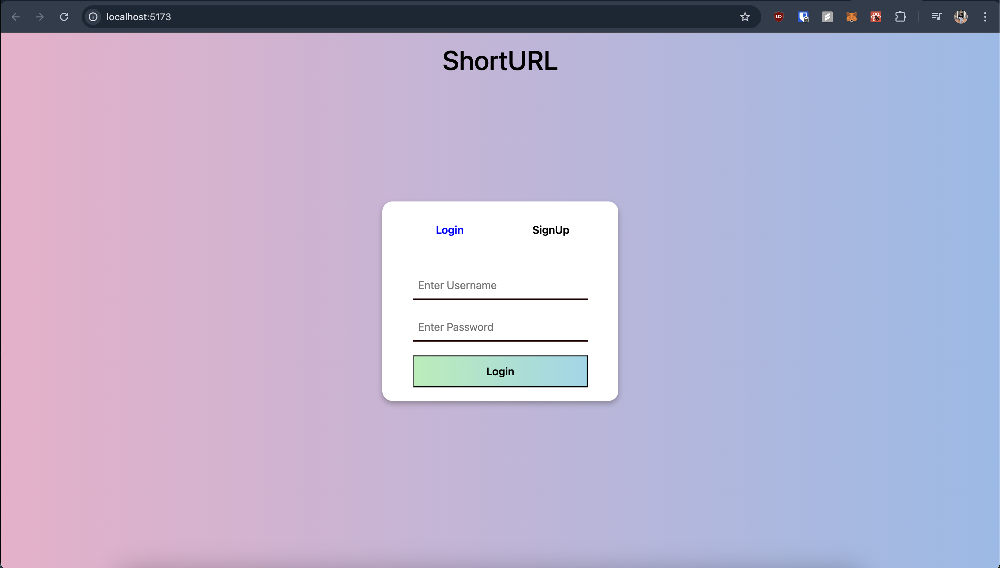
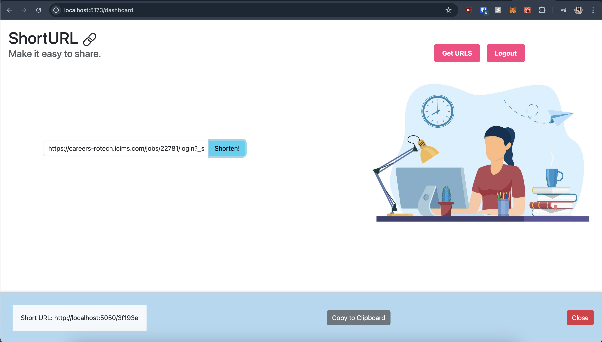
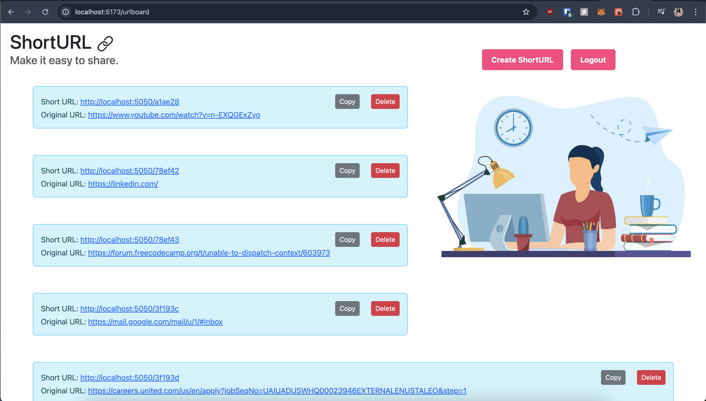

# URL Shortener

URL Shortener is a simple web service that allows users to shorten long URLs into more manageable and shareable links.

## Features

- Shorten long URLs into shorter ones.
- Redirect users from shortened URLs to the original long URLs.
- Shows list of URLs for the user.
- Delete URL from history.

## Technologies Used

- Go: Programming language used for the backend server.
- MongoDB: NoSQL database used for storing URL mappings.
- Gorilla Mux: Go package used for routing HTTP requests.
- React: JavaScript library used for building the frontend.
- Vite: Build tool for web development with React.
- Bootstrap: Frontend framework for styling.

## Getting Started

### Prerequisites

- Go installed on your local machine
- MongoDB installed and running locally or accessible via a MongoDB URI
- Node.js and npm (or yarn) installed on your local machine

### Installation

1. Clone the repository:

   ```bash
   git clone <repository-url>
2. Navigate to the project directory:
   ```bash
   cd url-shortener-react-go
3. Set up environment variables:
   Create a .env file in the project root directory and define the following variables:
   ```bash
   MONGODB_URI=<your-mongodb-uri>
   PORT=<port-number>
4. Install frontend dependencies
   ```bash
   cd frontend
   npm install

### Usage
1. Start the backend server:
   ```bash
   go run main.go
2. Start the frontend development server:
   ```bash
   cd frontend
   npm run dev

### Screenshots

### 1. Login Page
This is the login page where users can authenticate into the application.



### 2. Dashboard
After logging in, users are redirected to the dashboard, where they can shorten the URL.



### 3. Get URLs Page
The Get URLs page allows users to view and manage their shortened URLs.



